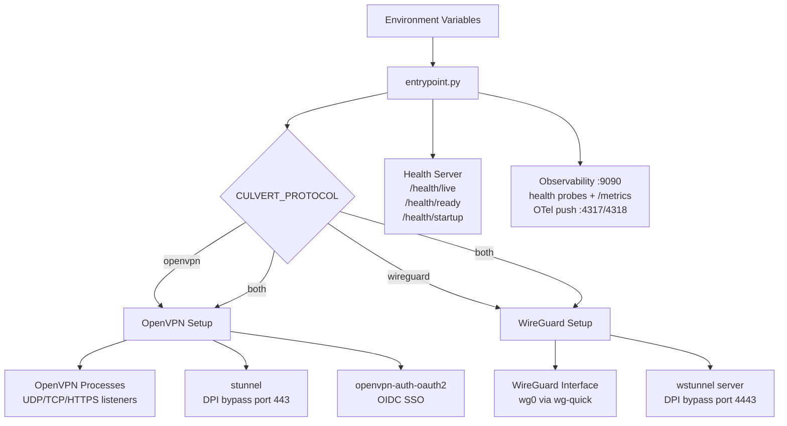

#  Culvert

The VPN server that installs like a container, because it is one.
OpenVPN and WireGuard in a single image, with DPI bypass, OIDC SSO, and
external PKI -- `docker run` it standalone or drop it into Kubernetes.

**License:** [Apache-2.0](LICENSE) | **Copyright:** (c) 2026 HYPERI PTY LIMITED

## Features

- **Protocols:** OpenVPN (UDP/TCP) and WireGuard, independently or both simultaneously
- **DPI bypass:** stunnel for OpenVPN on TCP/443, wstunnel for WireGuard on TCP/4443
- **OIDC SSO:** Works with Microsoft Entra ID, Google Workspace, Okta, Keycloak, Auth0 and other OIDC providers (OpenVPN only; WireGuard uses key-based auth)
- **External PKI:** File mounts, OpenBao (Vault-compatible), or AWS Secrets Manager; falls back to self-generated Easy-RSA CA
- **Observability:** Prometheus `/metrics` + OpenTelemetry OTLP export
- **K8s-ready:** `/health/live`, `/health/ready`, `/health/startup` probes; SIGTERM drain; cgroup-aware resource detection

## What it replaces

One image, no management-plane stack, no per-user fees. If you run one
of these today, Culvert covers the same ground:

| You use | What changes with Culvert |
|---------|--------------------------|
| [AWS Client VPN](https://aws.amazon.com/vpn/) | Flat cost of a node instead of ~USD 0.10/hr per subnet association plus USD 0.05/hr per connection (a 50-user, 4-subnet setup runs ~USD 850/month). Adds WireGuard, any-IdP OIDC, and TLS camouflage; AWS Client VPN is OpenVPN-only with a 50 Mbps per-connection baseline. You give up the managed control plane. |
| [kylemanna/docker-openvpn](https://github.com/kylemanna/docker-openvpn) | The most-pulled OpenVPN image (1.2B pulls) has been unmaintained since 2020 and ships OpenVPN 2.4. Culvert is the maintained successor shape: OpenVPN 2.7 with DCO, plus everything above. |
| [angristan/openvpn-install](https://github.com/angristan/openvpn-install) | Same result without a host-mutating bash script - the server is an image, config is env vars, upgrades are a `docker pull`. |
| [OpenVPN Access Server](https://openvpn.net/access-server/) | No per-connection licensing (free tier is 2 concurrent connections, then ~USD 7/connection/month). Culvert adds WireGuard and provider-neutral OIDC. |
| [wg-easy](https://github.com/wg-easy/wg-easy) | Keep the WireGuard simplicity, add OpenVPN for the clients that need it, per-connection OIDC SSO, external PKI, and DPI bypass. |

If you want a managed mesh overlay (Tailscale, NetBird) this is a
different shape: Culvert is a classic hub VPN server you run yourself,
for the cases that need OpenVPN compatibility, certificate-based
compliance, or networks where VPN traffic must look like HTTPS.

## Architecture



**Platforms:** `linux/amd64`, `linux/arm64`

## Quick start

The default is the simplest working server: OpenVPN over UDP, local PKI,
nothing else. Every other capability is a deliberate opt-in.

```bash
docker run -d \
  --cap-add=NET_ADMIN \
  --device=/dev/net/tun \
  -p 1194:1194/udp \
  -p 9090:9090/tcp \
  -e CULVERT_SERVER_CN=vpn.yourdomain.example \
  -v culvert-pki:/etc/vpn/pki \
  -v culvert-clients:/etc/vpn/clients \
  ghcr.io/hyperi-io/culvert:latest
```

Opt-ins, each with its own port publish:

| Capability | Enable with | Port |
|------------|-------------|------|
| WireGuard (alongside or instead) | `CULVERT_PROTOCOL=both` (or `wireguard`) | `51820/udp` |
| TCP fallback listener | `CULVERT_TCP_ENABLED=true` | `1194/tcp` |
| HTTPS-camouflaged OpenVPN (DPI bypass) | `CULVERT_HTTPS_ENABLED=true` + stunnel certs | `443/tcp` |
| HTTPS-camouflaged WireGuard (DPI bypass) | `CULVERT_WG_DPI_BYPASS_ENABLED=true` | `4443/tcp` |
| OIDC SSO | `CULVERT_OAUTH2_ENABLED=true` + IdP config | `9000-9002/tcp` |
| Prometheus metrics | `CULVERT_METRICS_ENABLED=true` | served on `9090/tcp` (already published) |

Then generate a client config:

```bash
docker exec -it <container> generate-client --name alice
```

See [docs/VPN-CLIENT-SETUP.md](docs/VPN-CLIENT-SETUP.md) for the full
client connection guide.

## Configuration

All runtime configuration is via `CULVERT_*` environment variables,
read through [scalo](https://pypi.org/project/scalo/)'s 7-layer cascade
(CLI → env → `.env` → `settings.{env}.yaml` → `settings.yaml` →
`defaults.yaml` → hard-coded), with opt-in profile YAML loaded as an
additional config source.

See [.env.example](.env.example) for the full list of variables and
their defaults.

### Deployment profiles

Site-specific defaults ship as YAML files under `profiles/` and load
opt-in via `CULVERT_PROFILE`. Explicit env vars always override
profile values.

| Profile | Description |
|---------|-------------|
| `example` | Reference template with placeholder site defaults |

Load a shipped profile:

```bash
CULVERT_PROFILE=/etc/vpn/profiles/example.yaml
```

Or write your own YAML file and point `CULVERT_PROFILE` at its path.

### Site identity (`CULVERT_ORG_NAME`)

Set `CULVERT_ORG_NAME=Acme` and the self-generated CA becomes
`Acme VPN CA` without any other configuration. Defaults to `VPN CA`.

## OIDC providers

culvert speaks generic OIDC via
[openvpn-auth-oauth2](https://github.com/jkroepke/openvpn-auth-oauth2).
Tested with:

- Microsoft Entra ID (Azure AD)
- Google Workspace
- Okta
- Keycloak
- Auth0

See [docs/VPN-CLIENT-SETUP.md](docs/VPN-CLIENT-SETUP.md) for
provider-specific setup snippets.

## External PKI

culvert supports three external PKI backends via
[scalo](https://pypi.org/project/scalo/) secrets:

- **File** — certs mounted from K8s Secret volumes or local paths
- **OpenBao** — HashiCorp Vault-compatible secrets engine
- **AWS Secrets Manager**

Local PKI mode (self-generated Easy-RSA CA) is the default for quick
starts and dev environments.

## Deployment

Culvert has two deliberate deployment targets - the same image serves
both:

- **Docker deploy** - a single host, `docker run` or the
  `docker-compose.yaml` in the repo. Local Easy-RSA PKI, env-var
  config, client configs on a volume. The five-minute path.
- **Enterprise Kubernetes** - Helm/ArgoCD-shaped: startup/liveness/
  readiness probes, SIGTERM connection drain, cgroup-aware capacity,
  external PKI (OpenBao or AWS), OIDC SSO, Prometheus + OTel. Expose
  the listeners via Gateway API TLS/UDP passthrough or a LoadBalancer.
  A reference Helm chart lives in
  [`deploy/helm/culvert`](deploy/helm/culvert), generated from culvert's
  scalo deployment contract (regenerate with
  `scripts/generate-deploy-artefacts.py`). It defaults to the simplest
  working server - OpenVPN UDP, NET_ADMIN, `/dev/net/tun` - with every
  other listener an opt-in via the chart's `extraPorts`. dfe-infra
  consumes this chart for its inbound VPN; the dependency runs
  dfe-infra -> culvert, never the reverse.

## Observability

One listener (`CULVERT_METRICS_ADDR`, default `0.0.0.0:9090`) carries the
operator surface, separate from VPN traffic:

- **Health:** `/healthz`, `/readyz` (plus `/health/live`, `/health/ready`,
  `/health/startup` aliases) - always served
- **Prometheus:** `/metrics` on the same port when `CULVERT_METRICS_ENABLED=true`
- **OpenTelemetry:** OTLP push to gRPC `:4317` / HTTP `:4318` collectors
  (when enabled via `CULVERT_OTEL_*`)

## Versioning

Releases follow [SemVer](https://semver.org/) and are published to
GHCR as multi-arch images. Site-generic defaults can be overridden per
deployment via the profile system. See [CHANGELOG.md](CHANGELOG.md).

## License

[Apache-2.0](LICENSE). Third-party components bundled in the container
image are listed in [NOTICE](NOTICE) with their own licences.

## Contributing

Pull requests welcome. See [CONTRIBUTING.md](CONTRIBUTING.md) for the
workflow, commit-message convention, and config conventions. Security
issues: see [SECURITY.md](SECURITY.md). Community expectations:
[CODE_OF_CONDUCT.md](CODE_OF_CONDUCT.md).
