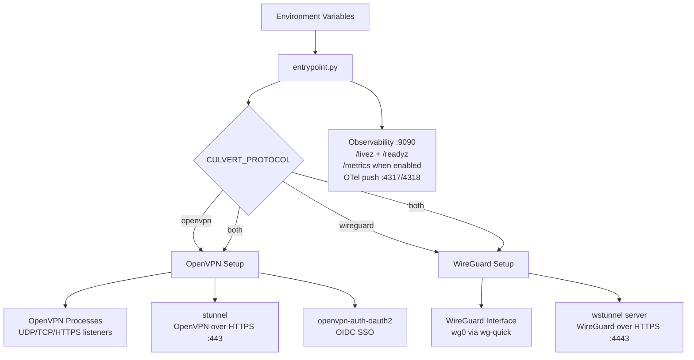

#  Culvert

The VPN server that installs like a container, because it is one.
OpenVPN and WireGuard in a single image, each optionally tunnelled over
HTTPS, with OIDC SSO and external PKI -- `docker run` it standalone or
drop it into Kubernetes.

**License:** [Apache-2.0](LICENSE) | **Copyright:** (c) 2026 HYPERI PTY LIMITED

## Features

- **Protocols:** OpenVPN (UDP/TCP) and WireGuard, independently or both simultaneously
- **VPN over HTTPS:** wrap either protocol in TLS on a web port - stunnel for OpenVPN on TCP/443, wstunnel for WireGuard on TCP/4443. Use it wherever only HTTPS gets out: locked-down corporate egress, hotel and conference wifi, captive portals, cloud egress policy, or networks that actively block VPN protocols
- **OIDC SSO:** Works with Microsoft Entra ID, Google Workspace, Okta, Keycloak, Auth0 and other OIDC providers (OpenVPN only; WireGuard uses key-based auth)
- **External PKI:** File mounts, OpenBao (Vault-compatible), or AWS Secrets Manager; falls back to self-generated Easy-RSA CA
- **Observability:** Prometheus `/metrics` + OpenTelemetry OTLP export
- **Crypto:** TLS 1.3 only, AES-256-GCM, SHA-384, P-384 PKI on the OpenVPN path - the CNSA 2.0 classical suite ([details and honest limits](#cryptography-and-cnsa-20))
- **K8s-ready:** `/livez` + `/readyz` probes; SIGTERM drain; cgroup-aware resource detection

## Coming from another VPN server?

Culvert is one image with no management-plane stack and no per-user
fees. If you already run one of these, here is what you gain by
switching - and what you give up:

| If you use | What you gain with Culvert |
|------------|----------------------------|
| [AWS Client VPN](https://aws.amazon.com/vpn/) | Flat cost of a node instead of per-subnet-association plus per-connection charges. Adds WireGuard, any-IdP OIDC, and the HTTPS-tunnelled listeners; AWS Client VPN is OpenVPN-only with a 50 Mbps per-connection baseline. You give up the managed control plane. |
| [kylemanna/docker-openvpn](https://github.com/kylemanna/docker-openvpn) | The most-pulled OpenVPN image (1.2B pulls) has been unmaintained since 2020 and its published image ships OpenVPN 2.4. Culvert is the maintained successor shape: OpenVPN 2.7 with DCO, plus everything above. |
| [angristan/openvpn-install](https://github.com/angristan/openvpn-install) | Same result (plus the extras) without a host-mutating bash script - the server is an image, config is env vars, upgrades are a `docker pull`. |
| [OpenVPN Access Server](https://openvpn.net/access-server/) | No per-connection licensing. Culvert adds WireGuard and provider-neutral OIDC. |
| [wg-easy](https://github.com/wg-easy/wg-easy) | Keep the WireGuard simplicity, add OpenVPN for the clients that need it, external PKI, and the option to run either protocol over HTTPS. wg-easy's OAuth (15.4+) signs users into its web UI; culvert's OIDC gates the VPN session itself. |

If you want a mesh overlay (Tailscale, NetBird) this is a different
shape: Culvert is a classic hub VPN server you run yourself, for the
cases that need OpenVPN client compatibility, certificate-based
compliance, or a VPN that travels over HTTPS.

## Architecture



**Platforms:** `linux/amd64`, `linux/arm64`

## Quick start

The default is the simplest working server: OpenVPN over UDP, local PKI,
nothing else. Every other capability is a deliberate opt-in.

```bash
docker run -d \
  --cap-add=NET_ADMIN \
  --device=/dev/net/tun \
  -p 1194:1194/udp \
  -p 127.0.0.1:9090:9090/tcp \
  -e CULVERT_SERVER_CN=vpn.yourdomain.example \
  -v culvert-pki:/etc/vpn/pki \
  -v culvert-clients:/etc/vpn/clients \
  ghcr.io/hyperi-io/culvert:latest
```

Opt-ins, each with its own port publish:

| Capability | Enable with | Port |
|------------|-------------|------|
| WireGuard (alongside or instead) | `CULVERT_PROTOCOL=both` (or `wireguard`) | `51820/udp` |
| TCP fallback listener | `CULVERT_TCP_ENABLED=true` | `1194/tcp` |
| OpenVPN over HTTPS (TLS on a web port) | `CULVERT_HTTPS_ENABLED=true` + stunnel certs | `443/tcp` |
| WireGuard over HTTPS (WebSocket/TLS) | `CULVERT_WG_HTTPS_TUNNEL_ENABLED=true` | `4443/tcp` |
| OIDC SSO | `CULVERT_OAUTH2_ENABLED=true` + IdP config | `9000-9002/tcp` |
| Prometheus metrics | `CULVERT_METRICS_ENABLED=true` | served on `9090/tcp` (already published) |

Then generate a client config:

```bash
docker exec -it <container> generate-client --name alice
```

See [docs/VPN-CLIENT-SETUP.md](docs/VPN-CLIENT-SETUP.md) for the full
client connection guide.

## Use cases

The quick start above is the tyre-kicker path. From there, culvert
ships opinionated profiles for the shapes we actually run it in - each
usable as-is with one `CULVERT_PROFILE=` switch, or as a base to tweak.
Each has a full walkthrough (deploy, client, ops) under [docs/](docs/):

- **Home / lab** ([docs/USE-CASE-HOME.md](docs/USE-CASE-HOME.md)) -
  reach your home LAN or a throwaway VM. OpenVPN UDP, split tunnel,
  local PKI. `CULVERT_PROFILE=home`.
- **Corporate** ([docs/USE-CASE-CORPORATE.md](docs/USE-CASE-CORPORATE.md))
  \- per-user certs plus OIDC SSO, group gating, TCP fallback, clean
  offboarding. `CULVERT_PROFILE=corporate`.
- **Restricted networks** ([docs/USE-CASE-TRAVEL.md](docs/USE-CASE-TRAVEL.md))
  \- run the VPN over HTTPS so it works where only web traffic gets out:
  hotel and conference wifi, captive portals, tight corporate egress, or a
  network that blocks VPN protocols outright. `CULVERT_PROFILE=travel`.
- **Kubernetes at scale**
  ([docs/USE-CASE-K8S-SCALE.md](docs/USE-CASE-K8S-SCALE.md)) - the Helm
  chart behind a load balancer: probes, drain, autoscaling, external
  PKI, metrics.
- **Edge fleet -> receiver**
  ([docs/USE-CASE-EDGE-FLEET.md](docs/USE-CASE-EDGE-FLEET.md)) - an
  appliance fleet streaming into a central receiver, with reverse
  admin back down the tunnels and CGNAT addressing.
  `CULVERT_PROFILE=edge-fleet`.

Addressing (why the tunnels default to `10.8.0.0/22`, when to use the
CGNAT range) is its own note: [docs/ADDRESSING.md](docs/ADDRESSING.md).

## Configuration

All runtime configuration is via `CULVERT_*` environment variables,
read through [scalo](https://pypi.org/project/scalo/)'s 7-layer cascade
(CLI -> env -> `.env` -> `settings.{env}.yaml` -> `settings.yaml` ->
`defaults.yaml` -> hard-coded), with opt-in profile YAML loaded as an
additional config source.

See [.env.example](.env.example) for the full list of variables and
their defaults.

### Deployment profiles

Site-specific defaults ship as YAML files under `profiles/` and load
opt-in via `CULVERT_PROFILE`. Explicit env vars always override
profile values.

Culvert ships opinionated presets for the common shapes. Each is
usable as-is once you set `CULVERT_SERVER_CN` (and the secrets a
preset needs), or as a starting point to copy and tweak:

| Profile | Shape | Walkthrough |
|---------|-------|-------------|
| `home` | OpenVPN UDP, split tunnel, local PKI - reach your home LAN or a lab VM | [docs/USE-CASE-HOME.md](docs/USE-CASE-HOME.md) |
| `corporate` | Per-user certs + OIDC SSO + group gating + TCP fallback | [docs/USE-CASE-CORPORATE.md](docs/USE-CASE-CORPORATE.md) |
| `travel` | OpenVPN + WireGuard over HTTPS, for networks that only pass web traffic | [docs/USE-CASE-TRAVEL.md](docs/USE-CASE-TRAVEL.md) |
| `edge-fleet` | Appliance fleet -> central receiver, reverse admin, CGNAT addressing | [docs/USE-CASE-EDGE-FLEET.md](docs/USE-CASE-EDGE-FLEET.md) |
| `example` | Reference template with placeholder site defaults | - |

Load a shipped profile (they live at `/etc/vpn/profiles/` in the
image, so the bare name works):

```bash
CULVERT_PROFILE=home
```

A profile sets the CULVERT_* configuration; the deployment side
(published ports, Helm values) is documented in each walkthrough. Or
write your own YAML and point `CULVERT_PROFILE` at its path. Explicit
env vars always override profile values.

### Site identity (`CULVERT_ORG_NAME`)

Set `CULVERT_ORG_NAME=Acme` and the self-generated CA becomes
`Acme VPN CA` without any other configuration. Defaults to `VPN CA`.

## OIDC providers

culvert speaks generic OIDC via
[openvpn-auth-oauth2](https://github.com/jkroepke/openvpn-auth-oauth2).
Tested with:

- Microsoft Entra ID (Azure AD)
- Google Workspace
- Okta
- Keycloak
- Auth0

See [docs/VPN-CLIENT-SETUP.md](docs/VPN-CLIENT-SETUP.md) for
provider-specific setup snippets.

## External PKI

culvert supports three external PKI backends via
[scalo](https://pypi.org/project/scalo/) secrets:

- **File** - certs mounted from K8s Secret volumes or local paths
- **OpenBao** - HashiCorp Vault-compatible secrets engine
- **AWS Secrets Manager**

Local PKI mode (self-generated Easy-RSA CA) is the default for quick
starts and dev environments.

## Cryptography and CNSA 2.0

The OpenVPN path ships the CNSA 2.0 *classical* suite by default, and
we are straight about where the limits are - no OSS VPN stack you can
commonly deploy today is fully CNSA 2.0 (the gap everywhere is ML-DSA).

What the defaults give you (OpenVPN, both the plain and the
HTTPS-tunnelled listeners):

- TLS 1.3 only (`tls-version-min 1.3`), no downgrade
- Data channel AES-256-GCM, SHA-384 control-channel auth. DCO requires an
  AEAD cipher rather than this one specifically - ChaCha20-Poly1305 also
  qualifies. DCO itself needs the kernel module on the HOST (Linux 6.16+, or
  ovpn-backports); without it OpenVPN encrypts in userspace and says so at
  startup
- Key exchange P-384 (`secp384r1`) first, X25519 as a compatibility
  fallback
- PKI defaults to EC P-384 certificates (`CULVERT_KEY_TYPE=ec`,
  `secp384r1`); RSA-4096 available
- `tls-crypt-v2` wraps the TLS handshake in a pre-shared symmetric
  layer (metadata protection and DoS mitigation)

The honest limits:

- **ChaCha20-Poly1305 and X25519 are accepted as secondary options**
  for client compatibility. Strict deployments can pin
  `data-ciphers AES-256-GCM` and `tls-groups secp384r1` via a custom
  server config.
- **WireGuard is outside CNSA by design.** Its suite is fixed
  (Curve25519, ChaCha20-Poly1305, BLAKE2s) and not configurable -
  that is a WireGuard protocol property, not a Culvert choice. Use the
  OpenVPN path where CNSA alignment matters.
- **No post-quantum key exchange yet.** OpenVPN takes its TLS groups from
  the crypto library, and the OpenSSL 3.0.13 in our Ubuntu 24.04 base has
  no ML-KEM - so CNSA 2.0's headline items (ML-KEM-1024, ML-DSA-87) are
  unavailable. The blocker is the base image, not OpenVPN: hybrid PQ groups
  light up once we build against OpenSSL 3.5+, and that base bump is the
  work. Meanwhile the `tls-crypt-v2` pre-shared wrap blunts
  harvest-now-decrypt-later collection of handshake metadata, but session
  keys are still classical ECDH.
- **On "fully CNSA 2.0"**: ML-KEM is starting to appear elsewhere -
  strongSwan 6.0+ ships `mlkem1024` for IKEv2, for instance. What no
  commonly deployable stack has yet is ML-DSA for authentication.

## Deployment

Culvert has two deliberate deployment targets - the same image serves
both:

- **Docker deploy** - a single host, `docker run` or the
  `docker-compose.yaml` in the repo. Local Easy-RSA PKI, env-var
  config, client configs on a volume. The five-minute path.
- **Enterprise Kubernetes** - Helm/ArgoCD-shaped: startup/liveness/
  readiness probes, SIGTERM connection drain, cgroup-aware capacity,
  external PKI (OpenBao or AWS), OIDC SSO, Prometheus + OTel. Expose
  the listeners via Gateway API TLS/UDP passthrough or a LoadBalancer.
  A reference Helm chart lives in
  [`deploy/helm/culvert`](deploy/helm/culvert), generated from culvert's
  scalo deployment contract (regenerate with
  `scripts/generate-deploy-artefacts.py`). It defaults to the simplest
  working server - OpenVPN UDP, NET_ADMIN, `/dev/net/tun` - with every
  other listener an opt-in via the chart's `extraPorts`.

## Observability

One listener (`CULVERT_METRICS_ADDR`, default `0.0.0.0:9090`) carries the
operator surface, separate from VPN traffic:

- **Health:** `/livez`, `/readyz` - always served. These are the only two;
  point a `startupProbe` at `/livez` (Kubernetes suspends liveness until the
  startup probe passes, so one path covers both a generous boot budget and a
  tight liveness period)
- **Prometheus:** `/metrics` on the same port when `CULVERT_METRICS_ENABLED=true`
- **OpenTelemetry:** OTLP push to gRPC `:4317` / HTTP `:4318` collectors
  (when enabled via `CULVERT_OTEL_*`)

## Versioning

Releases follow [SemVer](https://semver.org/) and are published to
GHCR as multi-arch images. Site-generic defaults can be overridden per
deployment via the profile system. See [CHANGELOG.md](CHANGELOG.md).

## License

[Apache-2.0](LICENSE). Third-party components bundled in the container
image are listed in [NOTICE](NOTICE) with their own licences.

## Contributing

Pull requests welcome. See [CONTRIBUTING.md](CONTRIBUTING.md) for the
workflow, commit-message convention, and config conventions. Security
issues: see [SECURITY.md](SECURITY.md). Community expectations:
[CODE_OF_CONDUCT.md](CODE_OF_CONDUCT.md).
