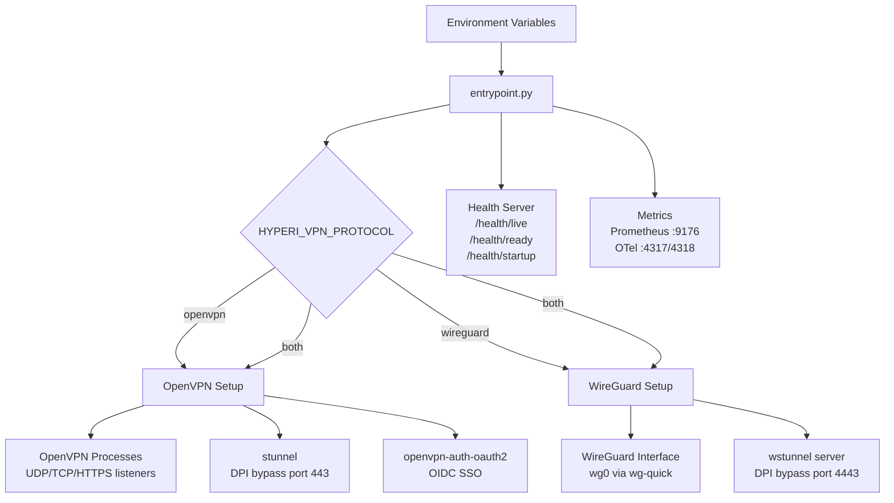

# hyperi-vpn

Production-ready VPN server container supporting OpenVPN and WireGuard,
with DPI bypass, OIDC SSO, and external PKI — deployable standalone or
in Kubernetes.

**License:** [FSL-1.1-ALv2](LICENSE) | **Copyright:** (c) 2026 HYPERI PTY LIMITED

## Features

- **Protocols:** OpenVPN (UDP/TCP) and WireGuard, independently or both simultaneously
- **DPI bypass:** stunnel for OpenVPN on TCP/443, wstunnel for WireGuard on TCP/4443
- **OIDC SSO:** Works with Microsoft Entra ID, Google Workspace, Okta, Keycloak, Auth0 and other OIDC providers (OpenVPN only; WireGuard uses key-based auth)
- **External PKI:** File mounts, OpenBao (Vault-compatible), or AWS Secrets Manager; falls back to self-generated Easy-RSA CA
- **Observability:** Prometheus `/metrics` + OpenTelemetry OTLP export
- **K8s-ready:** `/health/live`, `/health/ready`, `/health/startup` probes; SIGTERM drain; cgroup-aware resource detection

## Architecture



**Platforms:** `linux/amd64`, `linux/arm64`

## Quick start

```bash
docker run -d \
  --cap-add=NET_ADMIN \
  --device=/dev/net/tun \
  -p 1194:1194/udp \
  -p 1194:1194/tcp \
  -p 443:443/tcp \
  -p 51820:51820/udp \
  -p 4443:4443/tcp \
  -p 8080:8080/tcp \
  -e HYPERI_VPN_SERVER_CN=vpn.yourdomain.example \
  -e HYPERI_VPN_PROTOCOL=both \
  -v hyperi-vpn-pki:/etc/vpn/pki \
  -v hyperi-vpn-clients:/etc/vpn/clients \
  ghcr.io/hyperi-io/hyperi-vpn:latest
```

Then generate a client config:

```bash
docker exec -it <container> generate-client --name alice
```

See [docs/VPN-CLIENT-SETUP.md](docs/VPN-CLIENT-SETUP.md) for the full
client connection guide.

## Configuration

All runtime configuration is via `HYPERI_VPN_*` environment variables,
read through an 8-layer cascade (CLI → env → `.env` → profile YAML →
`settings.yaml` → `defaults.yaml` → library defaults → hard-coded).

See [.env.example](.env.example) for the full list of variables and
their defaults.

### Deployment profiles

Site-specific defaults ship as YAML files under `profiles/` and load
opt-in via `HYPERI_VPN_PROFILE`. Explicit env vars always override
profile values.

| Profile | Description |
|---------|-------------|
| `dfe` | HyperI DFE (Defensive Functional Edge) deployment defaults |

Load a shipped profile:

```bash
HYPERI_VPN_PROFILE=/etc/vpn/profiles/dfe.yaml
```

Or write your own YAML file and point `HYPERI_VPN_PROFILE` at its path.

### Site identity (`HYPERI_VPN_ORG_NAME`)

Set `HYPERI_VPN_ORG_NAME=Acme` and the self-generated CA becomes
`Acme VPN CA` without any other configuration. Defaults to `VPN CA`.

## OIDC providers

hyperi-vpn speaks generic OIDC via
[openvpn-auth-oauth2](https://github.com/jkroepke/openvpn-auth-oauth2).
Tested with:

- Microsoft Entra ID (Azure AD)
- Google Workspace
- Okta
- Keycloak
- Auth0

See [docs/VPN-CLIENT-SETUP.md](docs/VPN-CLIENT-SETUP.md) for
provider-specific setup snippets.

## External PKI

hyperi-vpn supports three external PKI backends via
[hyperi-pylib](https://pypi.org/project/hyperi-pylib/) secrets:

- **File** — certs mounted from K8s Secret volumes or local paths
- **OpenBao** — HashiCorp Vault-compatible secrets engine
- **AWS Secrets Manager**

Local PKI mode (self-generated Easy-RSA CA) is the default for quick
starts and dev environments.

## Deployment

- **Standalone:** `docker-compose.yaml` in the repo
- **Kubernetes:** Helm-chart friendly — probes, drain, and resource
  detection are already wired. A reference chart is not currently
  published; contributions welcome.

## Observability

- **Prometheus:** `/metrics` on `:9176`
- **OpenTelemetry:** OTLP gRPC on `:4317`, HTTP on `:4318` (when enabled via `HYPERI_VPN_OTEL_*`)
- **Health:** `/health/live`, `/health/ready`, `/health/startup` on `:8080`

## Versioning

`hyperi-vpn` is the public continuation of the private `dfe-vpn`
project. Versioning starts at v2.1.0 as a +0.1 feature release from
the v2.x line, with DFE-specific defaults replaced by generic ones and
a profile system for site-specific overrides.

Releases follow [SemVer](https://semver.org/) and are published to
GHCR as multi-arch images. See [CHANGELOG.md](CHANGELOG.md).

## License

[FSL-1.1-ALv2](LICENSE) — Functional Source License, Version 1.1, with
Apache 2.0 Future License. Free for non-production, internal, and
educational use; commercial production use terms apply. See
[COMMERCIAL.md](COMMERCIAL.md) for details.

Each release automatically converts to Apache 2.0 on the second
anniversary of its publication.

## Contributing

Pull requests welcome. See [CONTRIBUTING.md](CONTRIBUTING.md) for the
workflow, commit-message convention, and config conventions. Security
issues: see [SECURITY.md](SECURITY.md). Community expectations:
[CODE_OF_CONDUCT.md](CODE_OF_CONDUCT.md).
